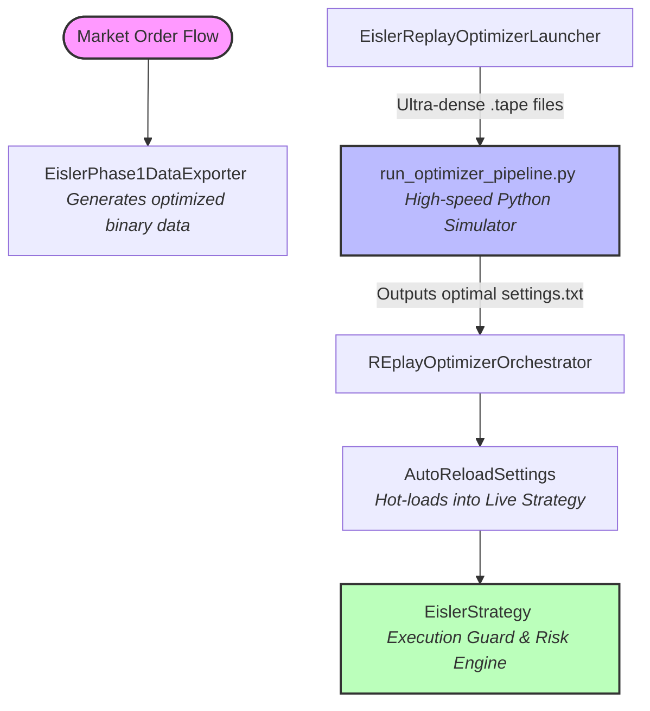

```markdown
# V15 Eisler Strategy with Automatic Optimizer Pipeline

An advanced, low-latency quantitative trading framework designed for NinjaTrader 8 (optimized for Nasdaq-100 / NQ 1-minute Volumetric bars) and tightly integrated with an automated, ultra-fast Python backtest optimization pipeline[cite: 1]. 

This repository bridges the gap between sophisticated microstructure-based execution (C#) and high-performance algorithmic parameter tuning (Python)[cite: 1]. The system is engineered to scan **100,000 parameter candidates within 3 to 4 minutes** using real market order flow data, directly hot-reloading the best configurations into the active strategy without requiring a recompile or chart refresh[cite: 1].

---

## System Architecture & Data Flow

The system operates in a closed-loop pipeline where data collection, mathematical simulation, orchestration, and state reinforcement happen asynchronously[cite: 1].


```



---

## Demonstration & Framework Overview

Youtube video:
<p align="center">
  <a href="https://www.youtube.com/watch?v=bfsAselzvJ0">
    
  </a>
</p>

---

## Comprehensive Code Analysis & Functionality

### 1. High-Performance Python Simulator (`run_optimizer_pipeline.py`)
This script acts as the heavy-lifting simulation engine of the framework[cite: 1]. Instead of relying on slow platform-based backtests, it implements a standalone, raw mathematical model of the strategy in Python to maximize computing speed[cite: 1].
* **Binary Stream Parsing:** It processes custom binary files (`market.tape`, `bars.tape`, etc.) generated from real market history[cite: 1]. It parses these streams utilizing direct byte-offset structures for maximum I/O performance[cite: 1].
* **V15 Timestamp Fallback Heuristics:** Implements an aggressive recovery mode (`parse_market_tape_samples_v15`)[cite: 1]. If the replay data contains corrupted or out-of-order timestamps from the platform, the parser bypasses the error and falls back to calculating structural mid-prices directly from the payload[cite: 1]. This prevents simulation crashes during volatile market periods[cite: 1].
* **Multi-Fold Validation Grid:** Automatically splits data into 6 distinct validation folds[cite: 1]. A parameter set is only considered valid if it generates a minimum of 15 realized trades per fold, preventing the strategy from overfitting to specific market anomalies[cite: 1].

### 2. Strategy & Execution Engine (`eislerstrategy.cs`)
The primary trading vehicle executing directly inside NinjaTrader 8[cite: 1]. It implements an enhanced Eisler-style event-impact model built entirely on Level 1 data and volumetric aggregates, bypassing heavy Level II order book dependencies[cite: 1].
* **Dynamic Regime Switching:** Automatically shifts between Large-tick and Small-tick market regimes based on spread-one probability tracking[cite: 1].
* **Microstructure Watchdog 2:** Continuous monitoring of liquidity toxicity, spread-to-ATR efficiency, and volume-to-price displacement absorption scores to block entries during dangerous market regimes[cite: 1].
* **Advanced Risk Engine:** Features an adaptive MFE (Maximum Favorable Excursion) lock, structural/chandelier trailing stops, and a strict 3-minute controlled soft-hold matrix (`MinHoldMsBeforeSoftSLExit = 180000`)[cite: 1]. It suppresses early failures on raw spikes but utilizes an absolute hard cap (`PostEntrySoftHardBreachTicks = 60`) to prevent catastrophic black swan drawdowns[cite: 1].

### 3. Asynchronous Data Exporter (`EislerPhase1DataExporter.cs`)
A high-efficiency, low-overhead data recorder running as an indicator or background service in NinjaTrader[cite: 1].
* **Memory Optimization:** It intercepts raw trade data, volume footprints, and book deltas, serializing them instantly into raw binary format using unmanaged memory buffers to avoid platform garbage collection pauses[cite: 1].
* **Binary File Payload Schema:**
  
| File Name | Record Size | Tracked Metrics / Payload Structure |
| :--- | :--- | :--- |
| `market.tape` | **44 bytes** | Sequence, Timestamp Ticks, Event Type, Price, Volume, Best Bid/Ask, Sizes[cite: 1]. |
| `bars.tape` | **60 bytes** | Bar Index, Open, High, Low, Close, Volume, ATR Ticks calibration[cite: 1]. |
| `flow.tape` | **92 bytes** | Buy/Sell Volume, Delta, Net Liquidity Pressure, Sweeps, Toxicity, Entropy[cite: 1]. |
| `levels.tape`| **128 bytes**| Footprint Analysis: Absorption Score, Persistency, Revisit & Continuation Probabilities[cite: 1]. |
| `depth.tape` | **28 bytes** | Order Book Depth Delta (Side, Operation, Position, Price, Volume)[cite: 1]. |

### 4. Orchestration & Dynamic Hot-Reloading Layer
These components handle the synchronization and communication between the C# platform environment and the external Python process[cite: 1].
* **`EislerReplayOptimizerLauncher.cs`:** Monitors market conditions and automatically executes the external Python pipeline process at a predefined trigger time (e.g., exactly at 10:00 AM or after a specific bar count)[cite: 1].
* **`REplayOptimizerOrchestrator.cs`:** The process manager[cite: 1]. It tracks the execution of `run_optimizer_pipeline.py`, manages process timeouts, handles system exceptions, and ensures clean date transitions during Automated Market Replay loops[cite: 1].
* **`AutoReloadSettings.cs` & `EislerAutoReload.cs`:** Once the Python pipeline outputs the optimal parameters into `settings.txt`, this layer acts as a security gateway[cite: 1]. It forcefully rejects any parameter files where the `RunId`, `Instrument`, or `ReplayDate` parameters do not mathematically match the active chart context, preventing dynamic memory injection errors[cite: 1].

---

## 📂 File Deployment & Directory Structure

To ensure the system executes correctly, the files must be deployed into their respective platform environments as outlined below[cite: 1].

### 1. NinjaTrader 8 Directory (C# Components)
All C# files must be placed inside your local NinjaTrader 8 document folder so the platform can compile them.

* **Strategy File:**
    * `eislerstrategy.cs` ──> Move to: `C:\Users\<YourWindowsUsername>\Documents\NinjaTrader 8\bin\Custom\Strategies\`
* **Orchestration, Integration & Exporter Scripts:**
    * `EislerReplayOptimizerLauncher.cs`
    * `REplayOptimizerOrchestrator.cs`
    * `AutoReloadSettings.cs`
    * `EislerAutoReload.cs`
    * `EislerPhase1DataExporter.cs`
    * ──> Move all five files to: `C:\Users\<YourWindowsUsername>\Documents\NinjaTrader 8\bin\Custom\Indicators\`

*Note: After moving the C# files, open NinjaTrader 8, go to the Control Center, press **F5** (or click Tools -> Compile) to rebuild the assembly.*

### 2. External Workspaces (Python & Configuration Environment)
The Python pipeline and optimization scripts must run in your dedicated orchestration bridge directory to allow the NinjaTrader processes to invoke them correctly[cite: 1].

* **Optimization Engine & Documentation:**
    * `run_optimizer_pipeline.py`
    * `README_EISLER_V15_BALANCED_REAL_TAPE_FIX.md`
    * ──> Move both files to: `C:\Users\<YourWindowsUsername>\Documents\EislerReplayOrchestratedBridge\`

### 🗂️ Target Architecture Overview
Once everything is deployed, your execution workspace will structure itself as follows[cite: 1]:

```

C:\Users<YourWindowsUsername>\Documents\EislerReplayOrchestratedBridge

├── run_optimizer_pipeline.py
├── README_EISLER_V15_BALANCED_REAL_TAPE_FIX.md
├── settings.txt                              <── Generated dynamically by Python
└── [Data_Directory]\                         <── Targeted binary streaming path
├── market.tape
├── bars.tape
├── flow.tape
├── levels.tape
└── depth.tape

```

---

## Execution Workflow

1. **Extraction Phase:** `EislerPhase1DataExporter` streams structured market microstructure data into optimized binary `.tape` files[cite: 1].
2. **Trigger Phase:** At the designated time or structural event, `EislerReplayOptimizerLauncher` fires up the Python background engine[cite: 1].
3. **Optimization Phase:** `run_optimizer_pipeline.py` consumes the binary files, running 100,000 parameter iterations through a 6-fold cross-validation algorithm[cite: 1].
4. **Export Phase:** The optimal parameter matrix is compiled and exported as a verified configuration file (`settings.txt`)[cite: 1].
5. **Hot-Reload Phase:** `AutoReloadSettings` intercepts the file, cross-checks safety markers, and live-injects the new parameters directly into `EislerStrategy` before the next execution cycle begins[cite: 1].

---

## ⚠️ Current Limitations & Roadmap for Future Development

While the V15 framework achieves ultra-fast mathematical optimization and seamless dynamic parameters loading, continuous improvement under live market regimes requires addressing specific structural and architectural limits.

### 1. Known Bottlenecks & Limitations
* **Single-Threaded I/O Block on Raw Tape Iteration:** Although the Python pipeline handles 100k sweeps in under 4 minutes, the binary parser (`parse_market_tape_samples_v15`) still operates sequentially on the raw file streams. High-volatility days with massive tick-counts bottleneck the I/O processing thread.
* **Deterministic Overfitting on Volumetric Profiles:** The 6-fold validation grid protects against standard statistical overfitting, but the deterministic simulation does not account for execution slippage or queue position degradation inside the volumetric price levels.
* **Lack of Latency-Arbitrage Benchmarking:** The dynamic gating engine blocks entries during high-jitter phases, but it cannot predict sub-millisecond execution delays on the broker side under highly congested network loops.

### 2. Strategic Future Roadmap
* **Parallelized Multi-Process Tape Streaming:** Refactoring the Python simulation layer to utilize shared memory spaces (`multiprocessing` / `SharedMemory`) to split the binary file chunks across multiple CPU cores for true multi-threaded performance.
* **GPU-Accelerated Parallel Evaluation:** Transitioning the inner mathematical evaluation loop from native Python loops to highly optimized PyTorch tensors or Numba-compiled C-arrays, aiming to push the 100k sweep time down to under 30 seconds.
* **Stochastic Slippage Profiling & Simulation:** Integrating a synthetic slippage matrix into the Python optimizer that applies randomized multi-tick fills based on real-time ATR values and relative volume-to-price displacement scores.
* **Cross-Asset Spread-Correlated Filters:** Expanding the C# execution guards to ingest correlated asset metrics (e.g., tracking ES/S&P500 microstructure shifts simultaneously) to block NQ executions during broad market liquidity evaporation events.

---

## 📚 References & Academic Foundation

The core logic of this strategy is heavily inspired by quantitative research on market microstructure, specifically analyzing how order book events (market orders, limit orders, and cancellations) impact prices.
* **Primary Literature:** Eisler, Z., Bouchaud, J.-P., & Kockelkoren, J. (2010). *The price impact of order book events: market orders, limit orders and cancellations*. Quantitative Finance. [arXiv:0904.0900](https://arxiv.org/abs/0904.0900)

```
